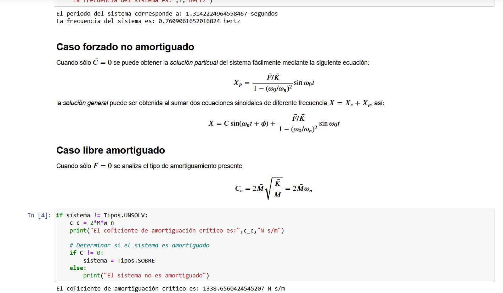

# Resumen soluciones vibraciones mecanicas
Jupyter Notebook realizado para resumir el procedimiento teórico y matemático de vibraciones mecánicas en sistemas varios.

Realizado como método de estudio para curso dinámica del Instituto Tecnológico de Costa Rica, buscando método de aprendizaje más apto para mí mismo.

Es posible usarlo mediante el binder, sin embargo este puede ser muy lento para iniciar, una vez cargado se pueden cambiar los valores de entrada y volver a correr las celdas.

## Enlace a Binder

## Dependencias
> 1. Numpy

## Licencia
GNU GPL 3.0, toda reutilización de este código fuente es permitida mientras el proyecto siga siendo de código abierto.
